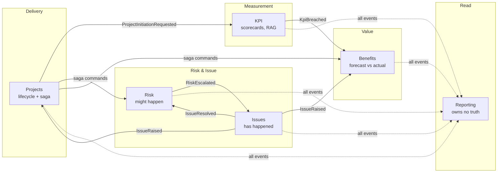
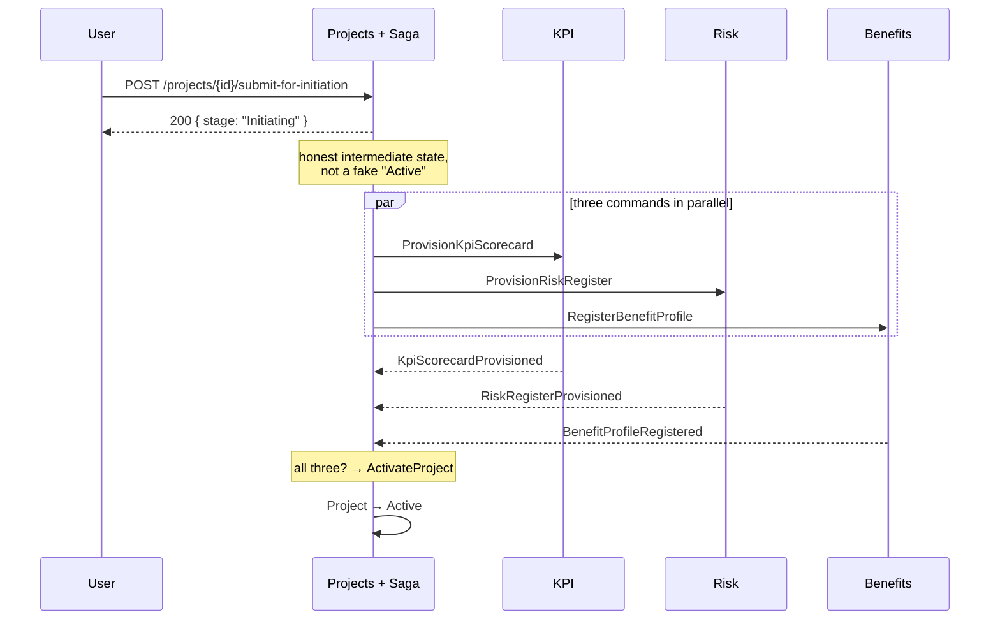
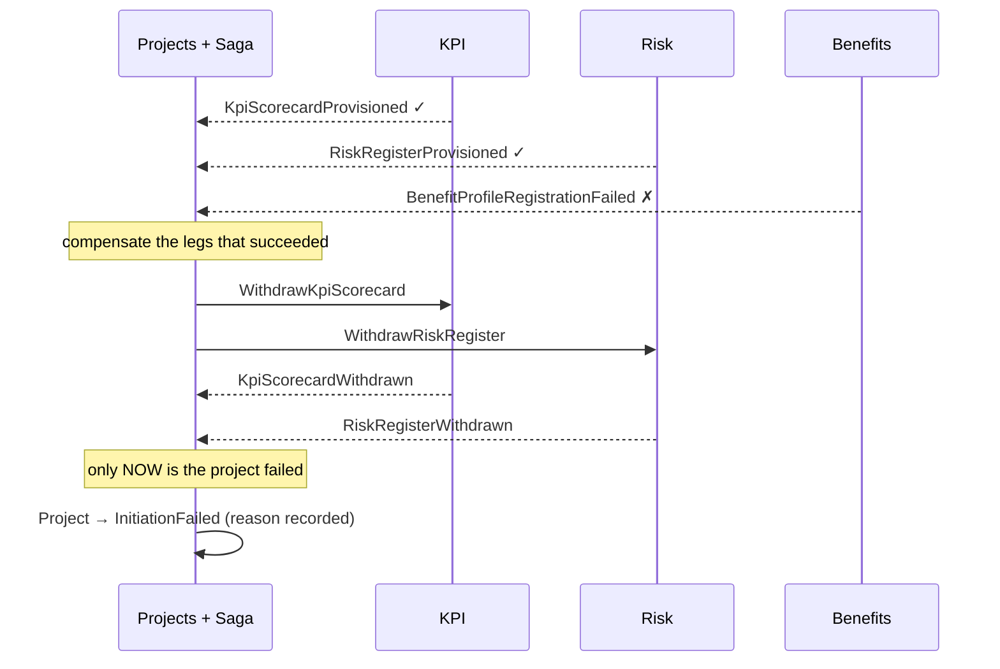
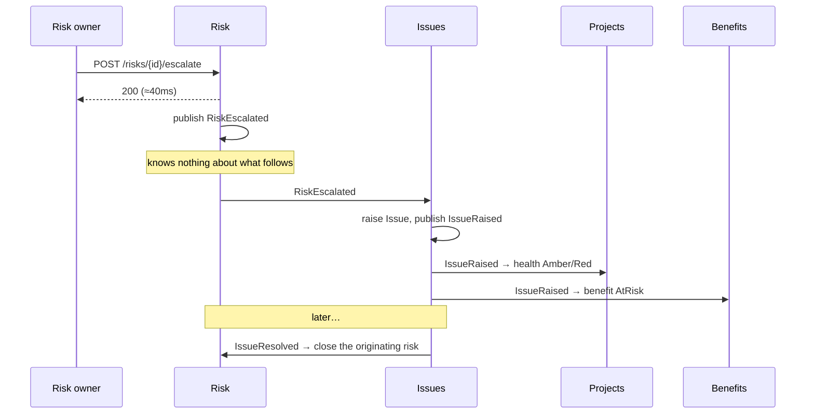
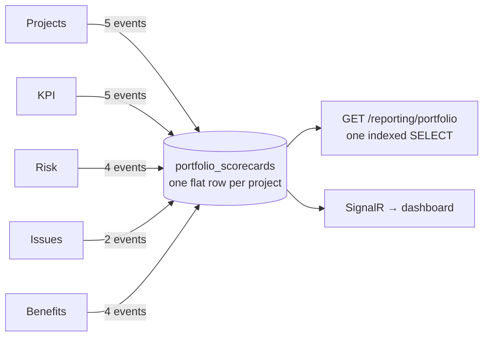

# StrategyOps — architecture

## The domain, and why it was chosen

Strategic Objectives are delivered by **Projects**, measured by **KPIs**, threatened by
**Risks** — which materialise into **Issues** — and justified by **Benefits**.

That domain is not decoration. It generates the three problems microservices interviews are
actually about:

| The domain produces… | …which forces |
|---|---|
| Initiating a project touches Projects, KPI, Risk and Benefits at once | a distributed transaction → **saga with compensation** |
| A risk materialises → an issue is raised → project health drops → a benefit is at risk | **event choreography** across four services |
| One portfolio dashboard reading across five databases | **CQRS** read model + **eventual consistency** |

## Services

```
                      ┌──────────────────────────┐
   client ───────────▶│  Gateway (YARP)  :5100   │
                      │  routing · edge JWT      │
                      │  rate limit · aggregation│
                      └────┬──────────────┬──────┘
                           │              │
        ┌──────────────────┴───┐      ┌───┴─────────────────┐
        │                      │      │                     │
   ┌────▼─────┐  ┌──────────┐  │  ┌───▼──────┐  ┌─────────┐ │
   │ Projects │  │   KPI    │  │  │ Identity │  │Discovery│ │
   │  :5101   │  │  :5102   │  │  │  :5107   │  │  :5108  │ │
   └────┬─────┘  └────┬─────┘  │  └──────────┘  └─────────┘ │
        │             │        │                            │
   ┌────▼─────┐  ┌────▼─────┐  │  ┌──────────┐              │
   │   Risk   │  │ Benefits │  │  │Reporting │◀─────────────┘
   │  :5103   │  │  :5105   │  │  │  :5106   │  read model
   └────┬─────┘  └────┬─────┘  │  └────▲─────┘  + SignalR
        │             │        │       │
   ┌────▼─────┐       │        │       │
   │  Issues  │       │        │       │
   │  :5104   │       │        │       │
   └────┬─────┘       │        │       │
        │             │        │       │
        └─────────────┴────────┴───────┘
                      │
              ╔═══════▼═══════╗
              ║   RabbitMQ    ║   every state change travels here
              ╚═══════════════╝
```

Each service owns its own database. **No service reads another's tables** — that single
constraint is the architecture, and everything else exists to cope with it.

## Context map



Risk and Issues are separate contexts on purpose. They look almost identical — a title, an
owner, a status, a severity — but a risk register is reviewed monthly by a risk owner and an
issue is chased daily against an SLA. **Different rate and reason for change.** The similarity
of the tables is a trap.

## Flow 1 — project initiation (orchestrated)



When Benefits refuses — a forecast over the portfolio ceiling:



Measured: 2 seconds from submit to `InitiationFailed`, with the scorecard, register and profile
all returning 404 afterwards.

## Flow 2 — risk escalation (choreographed)



No coordinator. Adding a fifth reaction tomorrow requires changing none of these services —
and that is exactly the trade: no file describes this flow, and you find it by searching for
consumers.

## Flow 3 — the read model (CQRS)



Seventeen projections. The row owns no truth — every column is a copy — and
`POST /reporting/rebuild` discards and rebuilds it from the source services.

## The building blocks every service shares

| Block | Solves |
|---|---|
| **Outbox** | the dual-write problem: entity + message commit in one local transaction |
| **Inbox** | at-least-once delivery: exactly-once *processing*, keyed on (MessageId, Consumer) |
| **Correlation** | one id across HTTP, the broker, and every log line |
| **Resilience** | timeout → retry+jitter → circuit breaker → per-attempt timeout, per dependency |
| **Auth** | JWT validation with a secure-by-default fallback policy |
| **Discovery** | lease-based registry + client-side load balancing |
| **Observability** | Serilog, OpenTelemetry, split liveness/readiness probes |

## Deliberate simplifications

Stated plainly, because being able to name them is worth more than pretending:

| Here | Production |
|---|---|
| SQLite file per service | PostgreSQL per service |
| HS256 shared signing key | RS256 + JWKS, via Entra ID / Duende / Keycloak |
| Password grant | authorization code + PKCE |
| Quartz in-memory scheduler | durable store, or RabbitMQ's delayed-exchange plugin |
| Home-grown service registry | Consul, or nothing at all on Kubernetes |
| Migrations on service startup | a migration Job that runs before the rollout |
| Saga commands published, not sent | endpoint conventions + `Send`, so a second consumer fails loudly |

## Where to read next

- [`00-start-here.md`](00-start-here.md) — a reading path
- [`questions/`](questions) — the 25 interview answers, each linked to code
- [`adr/`](adr) — nine decision records, each with the trade-off
- [`testing.md`](testing.md) — the four test tiers and why the middle is fat
- [`demo-script.md`](demo-script.md) — see all of it run
